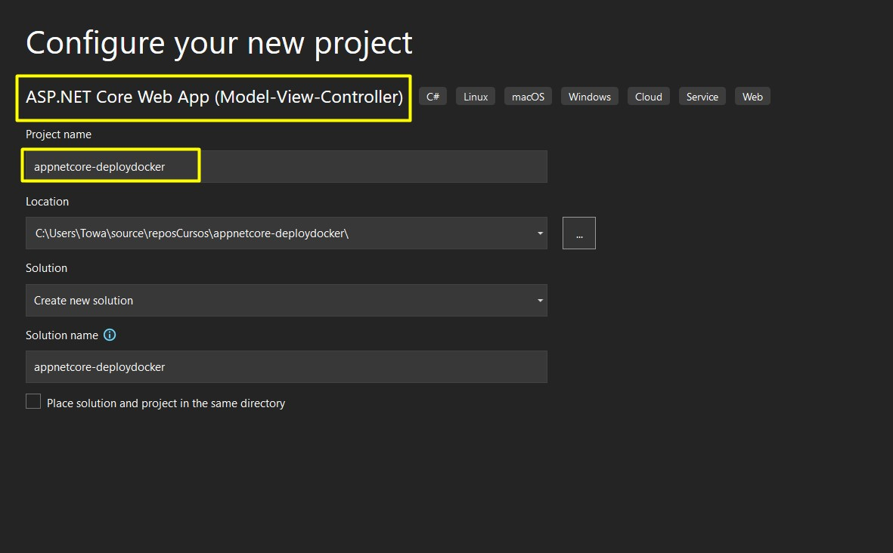

# appnetcore-deploydocker
# Despliegue de una WebApp NetCore con Docker

Vamos a hacer un ejemplo creando un proyecto 



Ojo. Docker aqui tiene que estar desactivado, despues
lo vamos a agregar de manera manual.


Corremos la aplicacion para ver que realmente esta 
funcionando


Agregamos el soporte con Docker.


Y escojemos linux ya que Doker es 100% nativo en linux


A continuacion se agrego automaticamente el Dockerfile


Esta instruccion siguiente solo aplica para APIS, para poder
ver la documentacion


Para crear imagen Docker ejecutamos el comando siguiente:

Este comando se debe ejecutar estando en el directorio donde 
esta la solucion.

> `docker image build -t versionname:1 -f .\appnetcore-deploydocker\Dockerfile .`


Comando para ver las imagenes

> `docker image ls`


Si quisieramos borrar la imagen creada lo hacemos con el siguiente
comando

> `docker image rm -f idImagen`
> Ejemplo -> `docker image rm -f 6516sdfsd61`


Con el siguiente comando listamos los contenedores

> `docker container ls`


A continuacion vamos a crear nuestro contenedor.

> docker container run --name helloContainerNetCore -d -p 8050:80 95399b5ab1a7

Donde 
* --name Afirmamos el nombre del contenedor
* -d  Indicamos que el contenedor se ejecute en segundo plano
* -p  Especificamos los puertos del contenedor Docker, primero es
del puerto del contenedor y el segundo es al interno del 
contenedor
* el numero final es el id de la imagen


Agunos comandos para trabajar con contenedores

- Localiza el nombre o id de los contenedores
> `docker ps -a`

- Eliminar un contenedor
> `docker rm ID_or_Name ID_or_Name`

- Detener un contenedor
> `docker stop {container-id}`

- Levantar un contenedor
> `docker start {container-id}`

- Si el container o mas bien la aplicacion no llegara a funcionar
correctamente, hay que buscar mas info en el Log del container,
por ejemplo, si no se ah establecido bien la conexion, nos los va 
a indicar en el log y se accede a traves del siguiente comando
> `docker container logs {container-id}`


Vamos a ver que efectivamente nuestro contenedor esta corriendo


***
***
***

A lo mejor en versiones anteriores se necesite descargar 
la img sdk 


Ver que significan el Archivo de Docker

```docker

# Decimos que vallamos a buscar la imagen y lo utilizamos aqui con
# el nombre de build
FROM mcr.microsoft.com/dotnet/sdk:6.0 as build

# Este es el nombre que le voy a dar a mi contenedor.
WORKDIR webapp 

# Ponemos el puerto para ir hacia la aplicacion.
EXPOSE 80
EXPOSE 5024

# Copiamos los archivos del proyecto.
# ./ nos ubicamos en el directorio que estamos y lo copiamos al mismo lugar 
# donde estamos dentro del contenedor de docker.

COPY ./*.csproj ./

# Verificamos que el archivo del proyecto tenga todas las dependencias. 
RUN dotnet restore 

#Copiar todo el resto hacia dentro del contenedor de docker.
COPY . .

# aqui estamos obteniendo los artefactos que docker va a necesitar para ejecutar nuestra aplicacion.
RUN dotnet publish -c Release -o out

# Build Image - Construimos la imagen.
FROM mcr.microsoft.com/dotnet/sdk:6.0
WORKDIR /webapp
COPY --from=build /webapp/out .

# Especificamos cual es el ejecutable
ENTRYPOINT ["dotnet", "/ProjectName.dll"]
```

Como recomendacion, hay que crear el Dockerfile desde Visual Studio.


